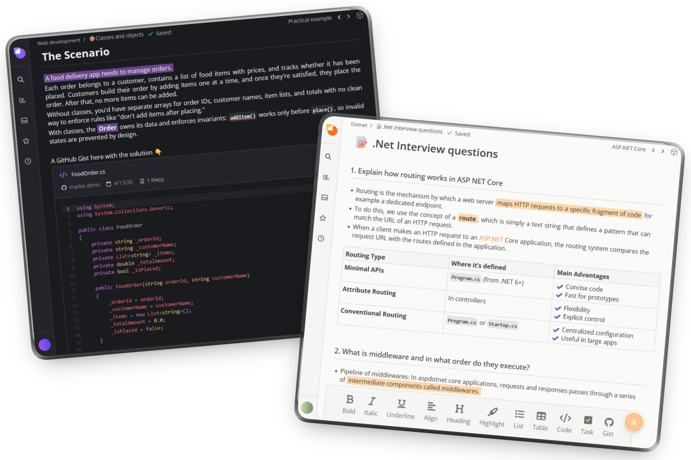
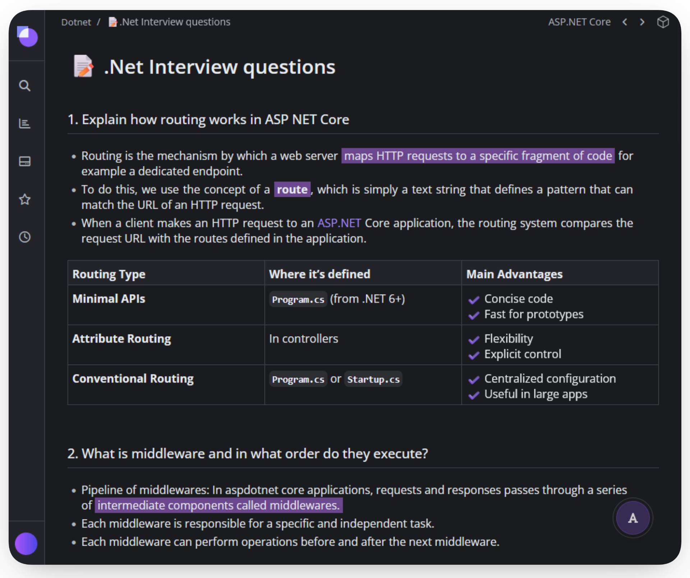
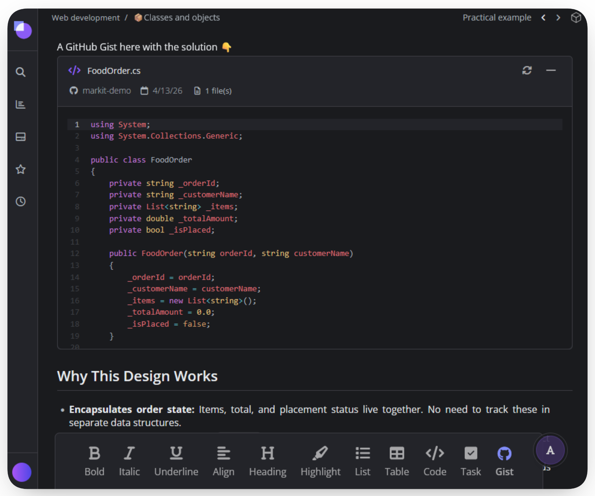
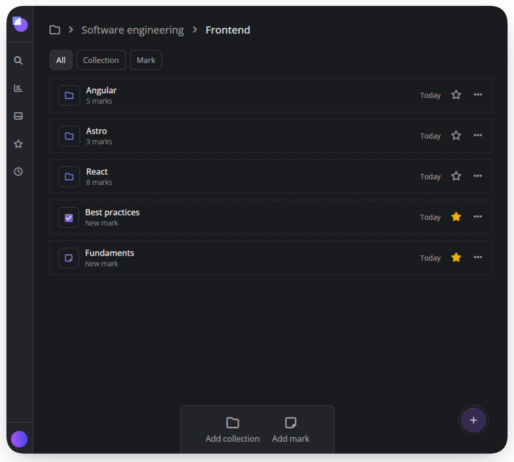

#  Markit

A nice place to capture your ideas, plan, document or just clarify your mind and leave a mark. Built using **.NET** and **Angular**.

    

## 🌟Highlights

- **Marks are just like notes but better**: **Marks** are the core of the application: enriched, modular documents that replace flat notes. They support a full spectrum of content all organized within a semantic **Block** hierarchy.
- **Go beyond flat text with Blocks**: modular content sections that give every mark a clear hierarchy, just like if you were working on your own notebook!.
- **A simple and familiar directory**: Organize a workspace with a tree-based directory, allowing to nest marks and collections to any depth.
-  **Attach GitHub Gists easily**: Instantly embed and navigate GitHub Gists by pasting a URL, giving code snippets clear semantic context.

## ℹ️ Overview

Markit was created to provide an intuitive, functional environment enriched with useful tech-integrations. Focusing on **speed, organization, and seamless workflow integration** to make note-taking a positive, efficient change in daily workflow.

[Try a live demo here! 🧪](https://www.jomacode.com/markit/demo)

### Tech stack

| Layer        | Technology     | Key Features                                                          |
| :----------- | :------------- | :-------------------------------------------------------------------- |
| **Frontend** | **Angular 20** | Standalone Components, Signals, PrimeNG UI, TipTap editor, CodeMirror |
| **Backend**  | **.NET 9**     | Clean Architecture, CQRS, EF Core                                     |
| **Database** | **PostgreSQL** | Relational Data Integrity, full-text search                           |

### Screenshots

    
    
    
    

## 🎯 Quick start
