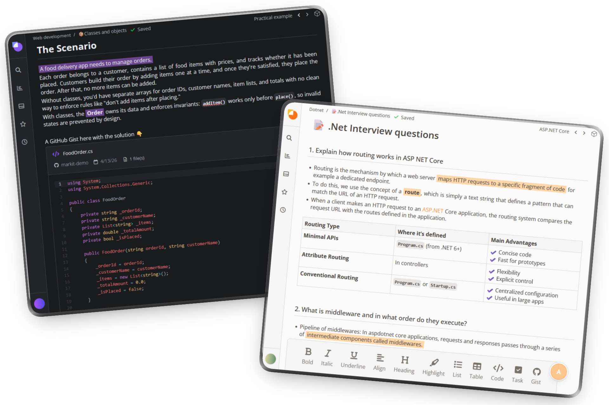
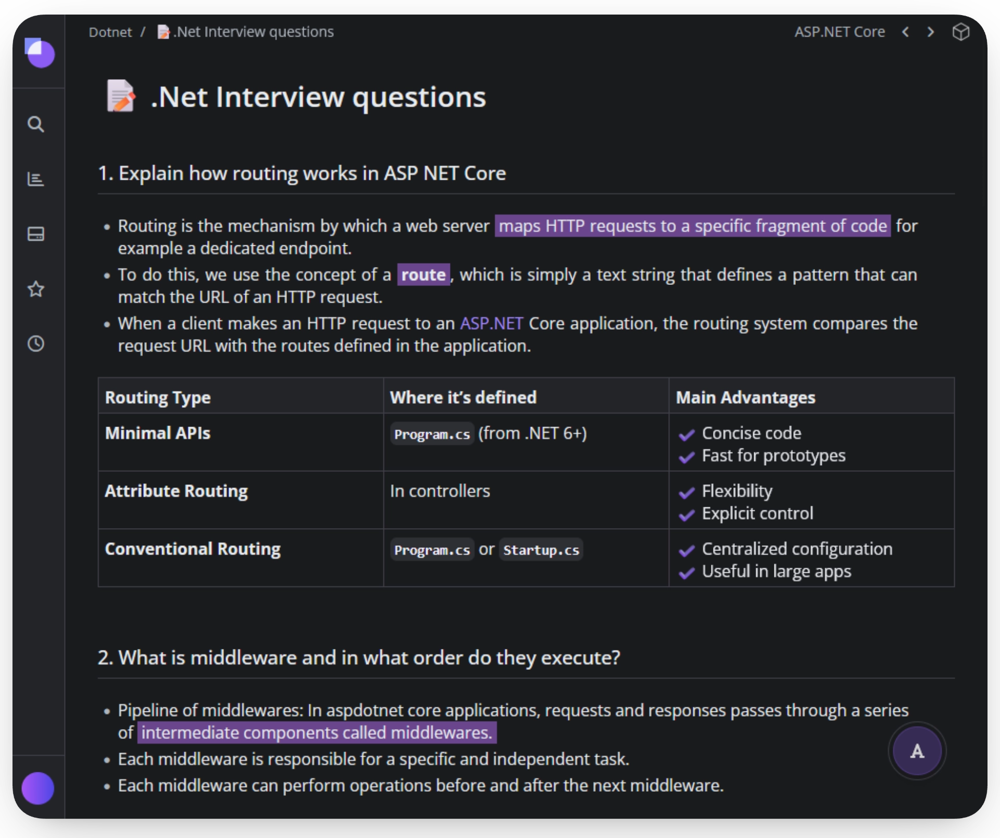
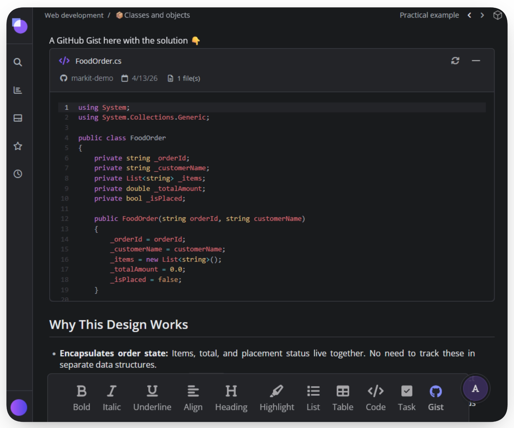
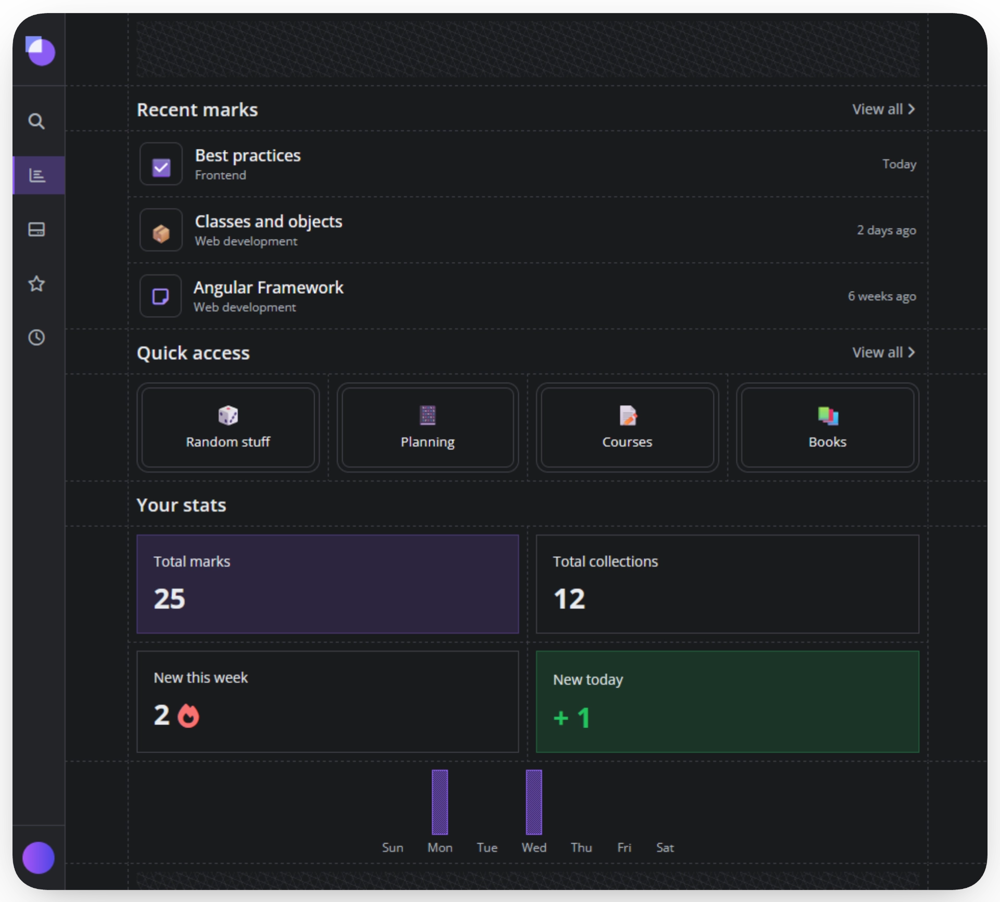
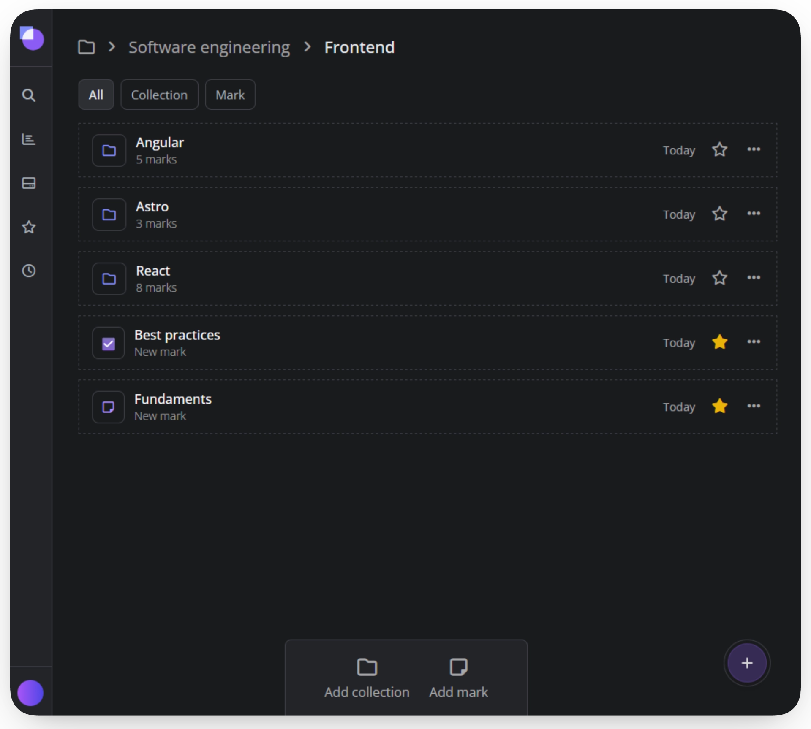

#  Markit

A nice place to capture your ideas, plan, document or just clarify your mind and leave a mark. Built using **.NET** and **Angular**.

[](https://www.jomacode.com/markit/demo)
[](#)

[](#)

<div align="center">
    
</div>

## 🌟Highlights

- **Marks are just like notes but better**: Marks are the core of the application: enriched, modular documents that replace flat notes. They support a full spectrum of content all organized within a semantic Block hierarchy.
- **Go beyond flat text with Blocks**: modular content sections that give every mark a clear hierarchy, just like if you were working on your own notebook!.
- **A simple and familiar directory**: Organize a workspace with a tree-based directory, allowing to nest marks and collections to any depth.
-  **Attach GitHub Gists easily**: Instantly embed and navigate GitHub Gists by pasting a URL, giving code snippets clear semantic context.

## ℹ️ Overview

Markit was created to provide an intuitive, functional environment enriched with useful tech-integrations. Focusing on **speed, organization, and seamless workflow integration** to make note-taking a positive, efficient change in daily workflow.

[Try a live demo here! 🧪](https://www.jomacode.com/markit/demo)

### Tech stack

| Layer        | Technology     | Key Features                                                          |
| :----------- | :------------- | :-------------------------------------------------------------------- |
| **Frontend** | **Angular 20** | Standalone Components, Signals, PrimeNG UI, TipTap editor, CodeMirror |
| **Backend**  | **.NET 9**     | Clean Architecture, CQRS, EF Core                                     |
| **Database** | **PostgreSQL** | Relational Data Integrity, full-text search                           |

### Screenshots

<div align="center">
    
    
    
    
</div>

## 🎯 Quick start
Get Markit running locally with automated setup scripts.

### Prerequisites

| Tool                                              | Version | Purpose             | Required        |
| :------------------------------------------------ | :------ | :------------------ | :-------------- |
| [.NET SDK](https://dotnet.microsoft.com/download) | 9.0+    | Backend API         | Yes             |
| [Node.js](https://nodejs.org/)                    | 18+     | Frontend build      | Yes             |
| [pnpm](https://pnpm.io/installation)              | 8+      | Package manager     | Yes             |
| [Docker](https://www.docker.com/get-started)      | Latest  | PostgreSQL database | Recommended     |


### Automated Setup (Recommended)
Configure Markit quickly using the **setup** script.

**Windows (PowerShell):**
```powershell
cd markit/scripts
./setup.ps1
```

**Linux/Mac:**
```bash
cd markit/scripts
chmod +x setup.sh
./setup.sh
```

The script will:
- Verify prerequisites (.NET, Node.js, pnpm, Docker)
- Start PostgreSQL in Docker
- Auto-generate a secure JWT key (or let you provide your own)
- Prompt for admin credentials
- Configure backend and frontend
- Install dependencies
- Optionally start services

> **💡 Tip**: Don't have Docker? Use the `-SkipDocker` flag (PowerShell) or `--skip-docker` flag (bash) with the setup script.

### 🔧 Advanced Setup Options

**Non-interactive setup** (all values via flags):
```powershell
./scripts/setup.ps1 -j "your-generated-jwt-key-64-chars-long" -u "admin@example.com" -p "SecurePass123"
```

**Without Docker** (using existing PostgreSQL):
```powershell
# PowerShell (Windows)
./scripts/setup.ps1 -SkipDocker -ConnectionString "Host=myserver;Port=5432;Database=markitdb;Username=myuser;Password=mypass"

# Bash (Linux/Mac)
./scripts/setup.sh --skip-docker --connection-string "Host=myserver;Port=5432;Database=markitdb;Username=myuser;Password=mypass"
```

**Setup only** (don't start services):
```powershell
# PowerShell (Windows)
./scripts/setup.ps1 -NoRun

# Bash (Linux/Mac)
./scripts/setup.sh --no-run
```

📖 Read the [Setup Guide](docs/SETUP.md) for detailed configuration and implementation info.

### Run Markit
You can also run Markit using the **run** script.
Useful when you already have Markit configured and want only to start the services.

```powershell
# PowerShell (Windows)
./scripts/run.ps1 -All

# Bash (Linux/Mac)
./scripts/run.sh --all
```
Markit UI will run by default at http://localhost:4200 unless you provide your own URLs during setup.

### 🐛 Troubleshooting

<details>
<summary><b>Setup script fails with "Prerequisites not met"</b></summary>

Ensure you have installed:
- .NET SDK 9.0+: `dotnet --version`
- Node.js 18+: `node --version`
- pnpm: `pnpm --version`

Install missing tools and run setup again.
</details>

<details>
<summary><b>Database connection fails</b></summary>

**With Docker:**
1. Ensure Docker is running: `docker ps`
2. Check container status: `docker-compose ps`
3. View logs: `docker-compose logs postgres`

**Without Docker:**
1. Verify PostgreSQL is running
2. Create database: `CREATE DATABASE markitdb;`
3. Check connection string in `Backend/markitAPI/API/appsettings.json`
</details>

<details>
<summary><b>Port already in use (5000 or 4200)</b></summary>

Another application is using the default ports. Options:
- Stop the conflicting application
- Change ports in configuration files
- Use different ports with setup flags: `--api-url http://localhost:5001 --spa-url http://localhost:4201`
</details>

<details>
<summary><b>CORS errors in browser</b></summary>

Ensure `SpaSettings.baseUrl` in `appsettings.json` matches your frontend URL (default: `http://localhost:4200`). Restart the backend after changes.
</details>